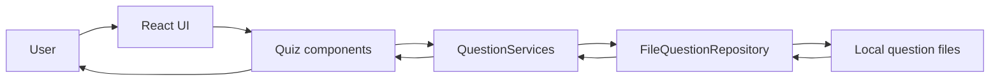
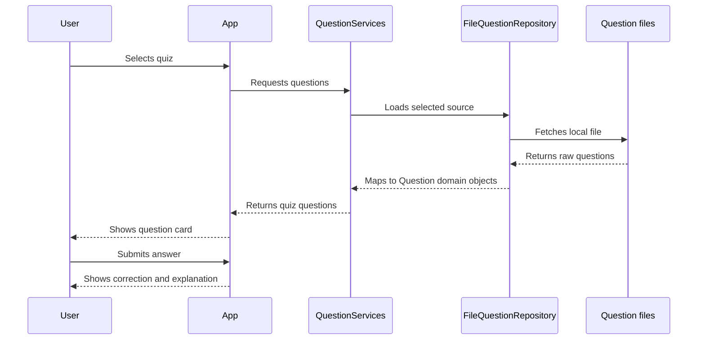
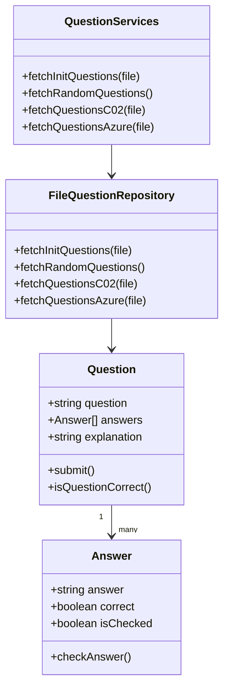

# KStios

Certification quiz app built with React, TypeScript and Vite to practice cloud exam questions.

## Overview

KStios helps users prepare for cloud certifications by loading local question banks, running practice quizzes and showing corrections with explanations after each answer.

The current question sets include AWS Cloud Practitioner and Azure AZ-500 practice exams.

## Live Demo

https://k-stios.vercel.app

## Features

- Select between AWS and Azure quiz sets.
- Run a random quiz from the available question bank.
- Answer single or multiple-choice questions.
- Check correct and incorrect answers after submitting.
- Read explanations and references when available.
- Track progress and final score.
- Restart a quiz without reloading the app.

## Tech Stack

- React 18
- TypeScript
- Vite
- Tailwind CSS
- Flowbite React
- Vitest

## Architecture



## Quiz Flow



## Domain Model



## Getting Started

```bash
npm install
npm run dev
```

The app runs locally with Vite. Open the URL printed in your terminal, usually `http://localhost:5173`.

## Quality Checks

```bash
npm run test -- --run
npm run build
```

## What This Project Demonstrates

- React component composition for an interactive quiz flow.
- TypeScript domain classes for questions and answers.
- Repository/service separation for loading different question formats.
- Local static data loading with Vite.
- Automated unit tests with Vitest.

## Roadmap

- Add screenshots to this README.
- Persist best score in local storage.
- Add quiz categories and filters.
- Improve mobile layout and empty/loading states.
- Add CI for build and tests.
